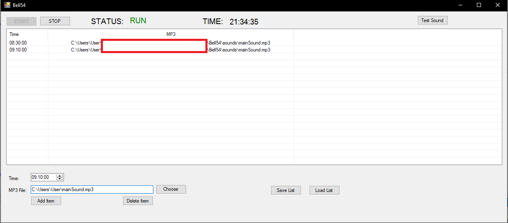

# Bell54 - Automatic bell system for schools
It is dead simple application

At certain time it plays .mp3 file

Its main idea is simple:

Timer is checking every second from list of bells

If time is equal app plays mp3

Binaries are in folder Bell54/obj/Release/ Bell54.exe

# Bell54 - Простая программа школьного звонка

Таймер проверяет каждую секунду есть ли из списка mp3 файл и проигрывает его

Исполняемый файл в папке Bell54/obj/Release/ Bell54.exe

Screenshot
======

